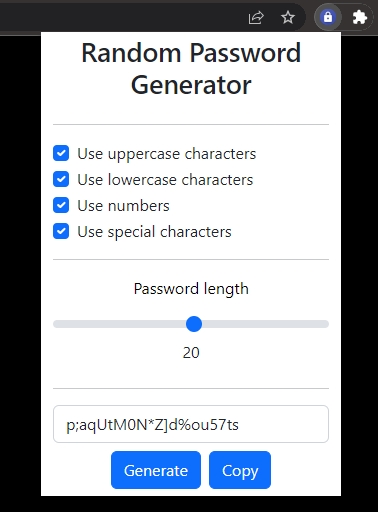

# Random Password Generator - Chrome Extension

    <!-- Chrome --->
    
    <!-- HTML -->
    
    <!-- CSS -->
    
    <!-- JavaScript -->
    

A lightweight extension for the Google Chrome Browser to generate random passwords.

# Images

    

        
    

    

        <i>Popup Menu</i>
    

    

        
    

    

        <i>Icon for Extensions Bar</i>
    

